# Cognee Workflow with Relational Record Matching - MVP v1

## Updated Pipeline Flow

This document shows the complete Cognee workflow with the new **Relational Record Matching** feature integrated.

### Key Changes

The relational record matching is inserted into the graph extraction pipeline **after ontology resolution** and **before DataPoint conversion**:

```
Extract Nodes/Edges
  ↓
Ontology Resolution (validate against ontology)
  ↓
[NEW] Relational Record Matching (link to DB records)
  ↓
[NEW] Entity Enrichment (add DB metadata to payload)
  ↓
Deduplication & Storage
```

---

## Updated Workflow Diagram

```mermaid
flowchart TD
    Start([User calls cognee.add]) --> Validate[Validate & Setup<br/>resolve_authorized_user_dataset<br/>reset_dataset_pipeline_run_status]

    Validate --> ResolveDirs[resolve_data_directories<br/>Expand directories to file lists]

    ResolveDirs --> LoopData[For each data item]

    LoopData --> SaveFile[save_data_item_to_storage<br/>Save original file/data]

    SaveFile --> ConvertText[data_item_to_text_file<br/>PDF/Image/Audio → Text<br/>OCR/Transcription/Parsing]

    ConvertText --> Classify[ingestion.classify<br/>Extract metadata:<br/>file_type, mime_type, size, hash]

    Classify --> Identify[ingestion.identify<br/>Generate data_id:<br/>hash of content + user_id]

    Identify --> CheckData{Data exists<br/>in RelationalDB?}

    CheckData -->|No| CreateData[Create Data object<br/>id, name, raw_data_location<br/>loader_engine, content_hash]

    CheckData -->|Yes| UpdateData[Update Data metadata<br/>raw_data_location, content_hash]

    CreateData --> StoreRelational[MERGE Data object<br/>Store in RelationalDB<br/>PostgreSQL/SQLite]

    UpdateData --> StoreRelational

    StoreRelational --> MoreData{More data<br/>items?}

    MoreData -->|Yes| LoopData
    MoreData -->|No| EndAdd([Phase 1 Complete:<br/>Data stored as Data objects])

    EndAdd --> StartCognify([User calls cognee.cognify])

    StartCognify --> SetupCognify[Setup & Configuration<br/>get_default_tasks<br/>resolve_authorized_datasets]

    SetupCognify --> ClassifyDocs[classify_documents<br/>Classify document types]

    ClassifyDocs --> CheckPerms[check_permissions_on_dataset<br/>Validate user write permissions]

    CheckPerms --> ChunkDocs[extract_chunks_from_documents<br/>TextChunker/LangchainChunker<br/>Split into semantic chunks]

    ChunkDocs --> ExtractGraph[extract_graph_from_data<br/>Graph extraction task]

    ExtractGraph --> ParallelLLM[Parallel Execution<br/>asyncio.gather for all chunks]

    ParallelLLM --> LLM1[LLM Call #1<br/>Knowledge Graph Extraction<br/>extract_content_graph<br/>PROMPT: generate_graph_prompt.txt<br/>MODEL: KnowledgeGraph<br/>Extract Nodes & Edges]

    LLM1 --> ParseGraph[Parse KnowledgeGraph response<br/>nodes: List&lt;Node&gt;<br/>edges: List&lt;Edge&gt;]

    ParseGraph --> ValidateEdges[Validate & filter edges<br/>Remove invalid source/target nodes]

    ValidateEdges --> IntegrateChunks[integrate_chunk_graphs<br/>Merge chunk graphs]

    IntegrateChunks --> RetrieveEdges[retrieve_existing_edges<br/>Query GraphDB for existing edges]

    RetrieveEdges --> OntologyExpand[expand_with_nodes_and_edges<br/>Phase 1: Ontology Resolution<br/>- Validate entities against ontology<br/>- Expand relationships<br/>- Merge duplicates via name mapping]

    OntologyExpand --> RelationalMatch["🆕 Relational Record Matching<br/>Phase 2: Link to DB Records<br/>- Batch load orgs & people records<br/>- Fuzzy match entity → DB record<br/>- Confidence threshold: 0.85<br/>- Return: record_id, table, confidence"]

    RelationalMatch --> EnrichEntity["🆕 Entity Enrichment<br/>Add metadata to payload:<br/>- postgres_record_id<br/>- postgres_table<br/>- match_field & confidence<br/>- Use canonical name from DB"]

    EnrichEntity --> ConvertToDP[Convert Node → DataPoint<br/>Node.id → DataPoint.id UUID<br/>Set metadata index_fields<br/>Include relational_record in payload]

    ConvertToDP --> FirstAddDP[add_data_points graph_nodes<br/>FIRST DATAPOINT STORAGE]

    FirstAddDP --> ValidateDP1[Validate DataPoints]

    ValidateDP1 --> ParallelExtract1[Parallel: get_graph_from_model<br/>for each DataPoint<br/>Recursive graph extraction]

    ParallelExtract1 --> Dedupe1[deduplicate_nodes_and_edges<br/>Remove duplicates]

    Dedupe1 --> StoreGraph1[Store in GraphDB<br/>graph_engine.add_nodes<br/>graph_engine.add_edges]

    StoreGraph1 --> Summarize[summarize_text<br/>Text summarization task]

    Summarize --> ParallelSummarize[Parallel Execution<br/>asyncio.gather for all chunks]

    ParallelSummarize --> LLM2[LLM Call #2<br/>Text Summarization<br/>extract_summary<br/>PROMPT: summarize_content.txt<br/>MODEL: TextSummary<br/>Generate concise summary]

    LLM2 --> ParseSummary[Parse TextSummary response<br/>Create TextSummary DataPoints<br/>Link via made_from field]

    ParseSummary --> FinalAddDP[add_data_points<br/>summary_data_points + nested<br/>FINAL DATAPOINT STORAGE]

    FinalAddDP --> ValidateDP2[Validate DataPoints]

    ValidateDP2 --> ParallelExtract2[Parallel: get_graph_from_model<br/>for each DataPoint<br/>Recursive traversal]

    ParallelExtract2 --> Dedupe2[deduplicate_nodes_and_edges<br/>Remove duplicates]

    Dedupe2 --> StoreGraph2[Store in GraphDB<br/>graph_engine.add_nodes<br/>graph_engine.add_edges]

    StoreGraph2 --> IndexDP[index_data_points<br/>Vector indexing task]

    IndexDP --> LoopDP[For each DataPoint]

    LoopDP --> ExtractFields[Extract index_fields<br/>from metadata<br/>Default: name, description]

    ExtractFields --> LoopFields[For each index_field]

    LoopFields --> CreateIndex[create_vector_index<br/>DataPointType_field_name<br/>e.g., Person_name]

    CreateIndex --> BatchEmbed[Batch embedding generation<br/>Extract field values<br/>Generate embeddings<br/>Parallel batches]

    BatchEmbed --> Embed1[Embedding #1<br/>index_data_points<br/>Store embeddings in VectorDB<br/>LanceDB/ChromaDB/PGVector]

    Embed1 --> MoreFields{More<br/>index_fields?}

    MoreFields -->|Yes| LoopFields
    MoreFields -->|No| MoreDP{More<br/>DataPoints?}

    MoreDP -->|Yes| LoopDP
    MoreDP -->|No| IndexEdges[index_graph_edges<br/>Generate edge embeddings<br/>Store in GraphDB]

    IndexEdges --> Embed2[Embedding #2<br/>index_graph_edges<br/>Store edge embeddings]

    Embed2 --> BuildResults[Build CognifyResults<br/>- Extracted nodes<br/>- Extracted edges<br/>- Summaries<br/>- Processing stats]

    BuildResults --> End([End: DataPoints stored<br/>in GraphDB + VectorDB<br/>with relational links])

    %% Styling
    classDef llmCall fill:#ff9999,stroke:#cc0000,stroke-width:2px
    classDef embedding fill:#99ccff,stroke:#0066cc,stroke-width:2px
    classDef decision fill:#ffff99,stroke:#cccc00,stroke-width:2px
    classDef storage fill:#99ff99,stroke:#00cc00,stroke-width:2px
    classDef parallel fill:#ffccff,stroke:#cc00cc,stroke-width:2px
    classDef new fill:#90EE90,stroke:#228B22,stroke-width:3px

    class LLM1,LLM2 llmCall
    class Embed1,Embed2,BatchEmbed embedding
    class CheckData,MoreData,MoreFields,MoreDP decision
    class StoreRelational,StoreGraph1,StoreGraph2,CreateIndex,IndexEdges storage
    class ParallelLLM,ParallelSummarize,ParallelExtract1,ParallelExtract2 parallel
    class RelationalMatch,EnrichEntity new
```



---

## New Components: Detailed View

### 1. Relational Record Matching Phase

**What happens:**
- Batch load all `orgs` and `people` records from relational DB (once per cognify call)
- For each ontology-resolved entity:
  - Extract entity name and resolved type
  - Determine target table from config (e.g., `Organization` → `orgs` table)
  - Fuzzy match entity name against primary field in table (e.g., `name` for orgs)
  - If similarity score ≥ 0.85: **match found**
  - Return matching record ID, table, and confidence score

**Input:**
- Entity node with:
  - `name`: "Apple Inc"
  - `type`: "Organization" (from ontology resolution)
  - `ontology_valid`: True

**Output:**
- RelationalEntityLink:
  - `record_id`: "550e8400-e29b-41d4-a716-446655440000"
  - `table_name`: "orgs"
  - `match_field`: "name"
  - `match_confidence`: 0.92
  - `matched_value`: "Apple Inc."

---

### 2. Entity Enrichment Phase

**What happens:**
- Add relational record metadata to entity payload
- Replace entity name with canonical name from DB record (to ensure consistency)
- Mark entity as `db_matched: true` (or `false` if no record found)

**Entity Before:**
```python
entity.payload = {
    "name": "Apple Inc",
    "type": "Organization",
    "ontology_class": "Organization",
    "ontology_valid": True
}
```

**Entity After:**
```python
entity.payload = {
    "canonical_name": "Apple Inc.",  # From DB (canonical authority)
    "type": "Organization",
    "ontology_class": "Organization",
    "ontology_valid": True,
    "db_matched": True,
    "relational_record": {
        "postgres_record_id": "550e8400-e29b-41d4-a716-446655440000",
        "postgres_table": "orgs",
        "match_field": "name",
        "match_confidence": 0.92
    }
}
```

---

## Data Flow: Before & After

### Before (Current Cognee)

```
Entity "Apple Inc"
  ↓
Ontology: Organization ✓
  ↓
Create Node in Graph
  ↓
Store with extracted name "Apple Inc"
```

**Problem:** Graph may have duplicate/variant names for same real-world entity

---

### After (With Relational Matching)

```
Entity "Apple Inc"
  ↓
Ontology: Organization ✓
  ↓
Relational Match: Found orgs.id=550e8400... (name: "Apple Inc.", confidence: 0.92)
  ↓
Enrich: Use canonical name "Apple Inc." from DB
  ↓
Create Node in Graph
  ↓
Store with:
  - Name: "Apple Inc." (canonical)
  - Reference: postgres_record_id
  ↓
Graph can be queried: "Show entities linked to org 550e8400..."
```

**Benefit:**
- Graph uses canonical entity names (source of truth)
- Can trace back to original DB records
- Supports future curation/synchronization

---

## Unmatched Entities

### What Happens

If an entity **doesn't match** any DB record:

```
Entity "Acme Corp (fictional)"
  ↓
Ontology: Organization ✓
  ↓
Relational Match: No match found (fuzzy score < 0.85)
  ↓
Enrich: Set db_matched=false
  ↓
Create Node in Graph
  ↓
Store with:
  - Name: "Acme Corp (fictional)" (original extracted name)
  - db_matched: false
  - relational_record: null
  ↓
Graph node exists independently
```

**Rationale:** Entity still captured in graph; can be reviewed/curated manually later

---

## MVP v1 Scope

### ✅ Included

- [x] Relational record matching for entities
- [x] Fuzzy matching with 0.85 confidence threshold
- [x] Configuration-driven entity type → table mapping
- [x] Canonical name enrichment from DB records
- [x] Batch loading of orgs/people records
- [x] One-way linking (Graph → DB)
- [x] Metadata in DataPoint payload

### ❌ Not Included (Future)

- [ ] Secondary field fallback (email for people, etc.)
- [ ] People-to-org relationship matching
- [ ] Reverse index (DB → Graph)
- [ ] Match confidence tuning per field type
- [ ] Phonetic/semantic matching
- [ ] Logging and observability

---

## Integration Checklist

### Files to Modify

- [ ] `cognee/modules/graph/utils/expand_with_nodes_and_edges.py`
  - Add `relational_record_matcher` parameter
  - Call matcher after `OntologyExpand`, before `ConvertToDP`

### Files to Create

- [ ] `cognee/modules/graph/utils/relational_record_matcher.py`
  - Core RelationalRecordMatcher class

- [ ] `cognee/modules/graph/models/relational_match_config.py`
  - RelationalMatchConfig dataclass

- [ ] `cognee/modules/graph/models/relational_entity_link.py`
  - RelationalEntityLink dataclass

- [ ] `cognee/infrastructure/databases/relational/queries/record_batch_queries.py`
  - Batch record fetching queries

### Files to Update Optionally

- [ ] `cognee/api/v1/endpoints/cognify.py` - Accept matcher in cognify endpoint (if exposing to API)
- [ ] DataPoint model - Add `relational_record` to payload schema

---

## Configuration Example

### Default Configuration (No Setup Needed)

```python
# cognify() will use default config if relational_record_matcher not provided
await cognee.cognify(
    dataset_name="my_dataset"
)
# Matching disabled by default; must explicitly pass matcher
```

### With Custom Configuration

```python
from cognee.modules.graph.utils.relational_record_matcher import RelationalRecordMatcher
from cognee.modules.graph.models.relational_match_config import RelationalMatchConfig

config = RelationalMatchConfig(
    confidence_threshold=0.85,
    entity_type_mapping={
        "Organization": ("orgs", "name"),
        "Company": ("orgs", "name"),
        "Person": ("people", "full_name"),
        "Individual": ("people", "full_name"),
    }
)

matcher = RelationalRecordMatcher(
    relational_engine=relational_engine,
    config=config
)

await cognee.cognify(
    dataset_name="my_dataset",
    relational_record_matcher=matcher
)
```

---

## Summary

The relational record matching feature extends Cognee's entity resolution by linking extracted entities to existing authoritative records in the relational database. Matched entities are enriched with record metadata and use canonical names, while unmatched entities float freely in the graph for future curation.

**Key characteristics:**
- **Non-invasive**: No changes to relational schema
- **Optional**: Disabled by default; opt-in via parameter
- **One-way linking**: Read-only from graph perspective
- **MVP-focused**: Simple, deterministic algorithm (no LLM needed)
- **Extensible**: Config-driven; easy to add more entity types/tables

See `RELATIONAL_RECORD_MATCHING_DESIGN.md` for detailed architecture and ambiguity analysis.
